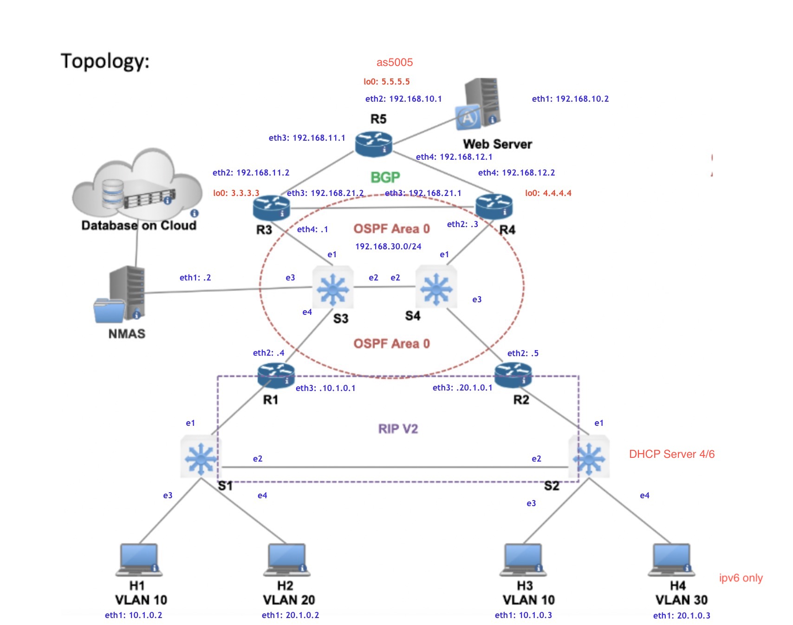

# Data Center Topology using FRRouting
While working at the tech giant RoboControls Network (RCN), upper management has learned
that you are pursuing a MS degree in Network Engineering from the world-renowned CU
Boulder, which is known for producing the best MANE’s in the industry. They have forced you
into the role of Senior Network Architect–and assigned you a project that will take
approximately 12 weeks to complete

The solution designed use five [FRR](https://frrouting.org/) routers connected four [OVS] (https://www.openvswitch.org/)  swithes workign as L2 swithes, as shown int the diagram: 





## Requirements

To use this lab, I installed [containerlab](https://containerlab.srlinux.dev/) (I used the [script method](https://containerlab.srlinux.dev/install/#install-script) Ubuntu 22.04 VM). You also need to have basic familiarity with [Docker](https://www.docker.com/).

This lab uses the following Docker images:

- [frrouting/frr](https://hub.docker.com/r/frrouting/frr)
- [globocom/openvswitch](https://hub.docker.com/r/globocom/openvswitch)
- [wilferna/netshoot](https://hub.docker.com/r/wilferna/vr-nxos)


## Starting lab

Use the following command to start the lab:

```
sudo containerlab deploy -t bgp.yml 
```

After running this command you would se the following containers:

```
+----+--------------------+
| #  |        Name        |
+----+--------------------+
|  1 | clab-bgp-H1        |
|  2 | clab-bgp-H2        |
|  3 | clab-bgp-H3        |
|  4 | clab-bgp-H4        |
|  5 | clab-bgp-NMAS      |
|  6 | clab-bgp-R1        |
|  7 | clab-bgp-R2        |
|  8 | clab-bgp-R3        |
|  9 | clab-bgp-R4        |
| 10 | clab-bgp-R5        |
| 11 | clab-bgp-S1        |
| 12 | clab-bgp-S2        |
| 13 | clab-bgp-S3        |
| 14 | clab-bgp-S4        |
| 15 | clab-bgp-Webserver |
+----+--------------------+

```

and easy way test connectivity between hosts is running ping once you are connected to the host:

```
sudo docker exec -it  clab-bgp-H1 /bin/bash

```

To connect to the router use:

```
sudo docker exec -it clab-bgp-R3 vtysh

```

## BGP verification

To confirm BGP sessions are established among all peers.  

   ```
   $ sudo docker exec clab-bgp-R3 vtysh -c "show bgp summary"
   ```

To show the routes learned from BGP in the routing table. Notices there are two paths to each host.

   ```
    $ sudo docker exec clab-bgp-R3 vtysh -c "show ip route bgp"
   ```

Ping from any one host to another to verify connectivity.

    ```
    $ docker exec clab-bgp-H1 ping 10.1.0.3
    ```


## OVS consideration

Something that I had to consider is add the port to the OVS switch, when we connect links in containerlab to the switch, I have to add this interface to the bridge created in OVS.
This are the steps to configure OVS:
1.- Create the bridge in OVS:

```
sudo docker exec clab-bgp2-S1 ovs-vsctl add-br ovsbr0 
```
2.- Bring up the bridge in the Host (like an interface):

```
sudo docker exec clab-bgp2-S1 ifconfig ovsbr0 up
```
3.- Finally add the port where the other devices are connected to the bridge ovsbr0:

```
sudo docker exec clab-bgp2-S1 ovs-vsctl add-port ovsbr0 eth1
sudo docker exec clab-bgp2-S1 ovs-vsctl add-port ovsbr0 eth2
```

In summary I was not ableto configure the step 3 in the containerlab yml file, so I created an additional file add_ports.sh to fix this. 
```
cat add_ports.sh 
sudo docker exec clab-bgp-S1 ovs-vsctl add-port ovsbr0 e1
sudo docker exec clab-bgp-S1 ovs-vsctl add-port ovsbr0 e2
sudo docker exec clab-bgp-S1 ovs-vsctl add-port ovsbr0 e3
sudo docker exec clab-bgp-S1 ovs-vsctl add-port ovsbr0 e4

sudo docker exec clab-bgp-S2 ovs-vsctl add-port ovsbr0 e1
sudo docker exec clab-bgp-S2 ovs-vsctl add-port ovsbr0 e2
sudo docker exec clab-bgp-S2 ovs-vsctl add-port ovsbr0 e3
sudo docker exec clab-bgp-S2 ovs-vsctl add-port ovsbr0 e4

sudo docker exec clab-bgp-S3 ovs-vsctl add-port ovsbr0 e1
sudo docker exec clab-bgp-S3 ovs-vsctl add-port ovsbr0 e2
sudo docker exec clab-bgp-S3 ovs-vsctl add-port ovsbr0 e3
sudo docker exec clab-bgp-S3 ovs-vsctl add-port ovsbr0 e4

sudo docker exec clab-bgp-S4 ovs-vsctl add-port ovsbr0 e1
sudo docker exec clab-bgp-S4 ovs-vsctl add-port ovsbr0 e2
sudo docker exec clab-bgp-S4 ovs-vsctl add-port ovsbr0 e3
```

Finally I was able to configure the routing protocols required and have full connectivity

```
sudo docker exec -it clab-bgp-R5 vtysh -c "show ip route bgp"
Codes: K - kernel route, C - connected, S - static, R - RIP,
       O - OSPF, I - IS-IS, B - BGP, E - EIGRP, N - NHRP,
       T - Table, v - VNC, V - VNC-Direct, A - Babel, F - PBR,
       f - OpenFabric,
       > - selected route, * - FIB route, q - queued, r - rejected, b - backup
       t - trapped, o - offload failure

B>* 192.168.21.0/24 [200/0] via 192.168.11.2, eth3, weight 1, 00:22:31
  *                         via 192.168.12.2, eth4, weight 1, 00:22:31

```
Other way to see the same information:
```
sudo docker exec -it clab-bgp-R5 vtysh -c "show ip route bgp"
Codes: K - kernel route, C - connected, S - static, R - RIP,
       O - OSPF, I - IS-IS, B - BGP, E - EIGRP, N - NHRP,
       T - Table, v - VNC, V - VNC-Direct, A - Babel, F - PBR,
       f - OpenFabric,
       > - selected route, * - FIB route, q - queued, r - rejected, b - backup
       t - trapped, o - offload failure

B>* 192.168.21.0/24 [200/0] via 192.168.11.2, eth3, weight 1, 00:22:31
  *                         via 192.168.12.2, eth4, weight 1, 00:22:31


```
conncetivity:
```
sudo docker exec -it  clab-bgp-H1 /bin/bash
bash-5.1# ping 10.1.0.3
PING 10.1.0.3 (10.1.0.3) 56(84) bytes of data.
From 10.1.0.2 icmp_seq=1 Destination Host Unreachable
From 10.1.0.2 icmp_seq=2 Destination Host Unreachable
From 10.1.0.2 icmp_seq=3 Destination Host Unreachable
From 10.1.0.2 icmp_seq=4 Destination Host Unreachable
From 10.1.0.2 icmp_seq=5 Destination Host Unreachable
From 10.1.0.2 icmp_seq=6 Destination Host Unreachable
From 10.1.0.2 icmp_seq=7 Destination Host Unreachable
From 10.1.0.2 icmp_seq=8 Destination Host Unreachable
From 10.1.0.2 icmp_seq=9 Destination Host Unreachable
^C
--- 10.1.0.3 ping statistics ---
11 packets transmitted, 0 received, +9 errors, 100% packet loss, time 10229ms
pipe 4
bash-5.1# ping 10.1.0.3
PING 10.1.0.3 (10.1.0.3) 56(84) bytes of data.
64 bytes from 10.1.0.3: icmp_seq=1 ttl=64 time=3.40 ms
64 bytes from 10.1.0.3: icmp_seq=2 ttl=64 time=0.082 ms
64 bytes from 10.1.0.3: icmp_seq=3 ttl=64 time=0.082 ms
^C
--- 10.1.0.3 ping statistics ---
3 packets transmitted, 3 received, 0% packet loss, time 2002ms
rtt min/avg/max/mdev = 0.082/1.186/3.396/1.562 ms
bash-5.1# 
```
